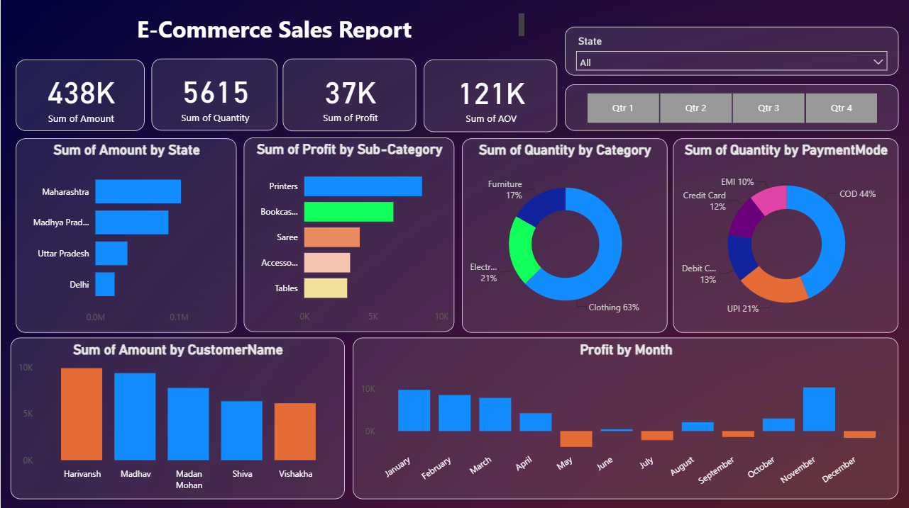

# ecommerce-sales-powerbi-dashboard
Interactive E-Commerce Sales Analytics Dashboard built with Microsoft Power BI.
# E-Commerce Sales Analytics Dashboard

## Project Overview

An interactive E-Commerce Sales Analytics Dashboard created using Microsoft Power BI.

The dashboard provides a visual overview of sales performance, profitability, customer sales, product categories, payment methods, and monthly profit trends.

## Tool Used

- Microsoft Power BI

## Dashboard Features

### Key Performance Indicators

- Total Sales Amount
- Total Quantity
- Total Profit
- Average Order Value (AOV)

### Analysis

- Sales Amount by State
- Profit by Sub-Category
- Quantity by Category
- Quantity by Payment Mode
- Sales Amount by Customer
- Monthly Profit Analysis

### Interactive Filters

- State
- Quarter

## Dashboard Preview

## Project Objective

The objective of this project was to analyze e-commerce sales data and present important business metrics and trends through an interactive Power BI dashboard.

## Project Background

This project was created as part of my earlier data analysis work and demonstrates my practical experience with Power BI, data visualization, and business-oriented analysis.
